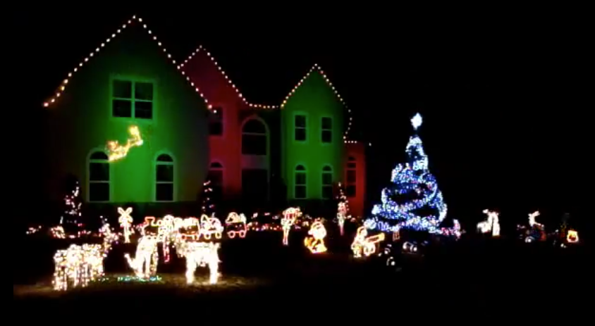
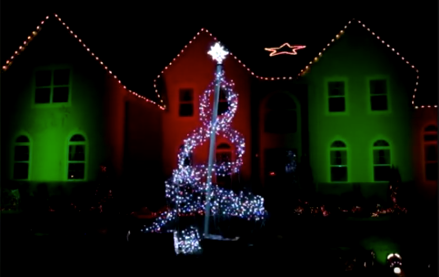

# Animated Holiday Light Displays

My enthusiasm for light started at a young age. My first word was *light*, and I was six years old when my family gave me control of the holiday lighting in our front yard.

Little did my parents know that the holiday display would quickly grow out of control. Within a few years, we went from winning our neighborhood competition, to beating the whole city twice, to getting disqualified from ever entering again.

I continue to build light shows today. Please let me know if you enjoy my work or are interested in collaborations by [contacting](./connect) me.

## 2017 Rockefeller Center Window Display

I was contracted to build a lighting installation for a prominent retailer in New York City's Rockefeller Center. 

Working with leading chocolate experts, I helped build the world's first all-chocolate Twitter-controlled color-changing holiday window display. I was responsible for all lighting aspects of the project, which involved writing thousands of lines of software code and building custom control hardware.

[Learn more](./nyc-display-2017).

## 2009-2012 Show: The Magic of the Polar Express

Watch the videos:

[Preview](https://www.youtube.com/watch?v=t6hN_d4IQJQ) (1:46)

[Full show](https://www.youtube.com/watch?v=L_e-QoJuuI0) (12:04)

## 2008 Show: Shine, a Christmas Spectacular

Watch the video:

[Full show](https://www.youtube.com/watch?v=flpbwOCzUMU)

